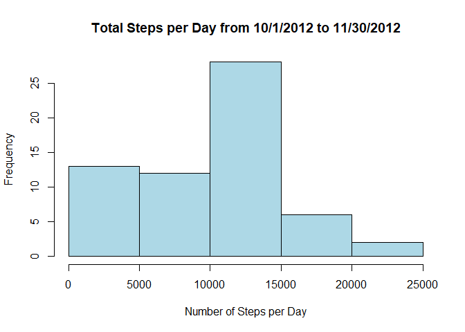
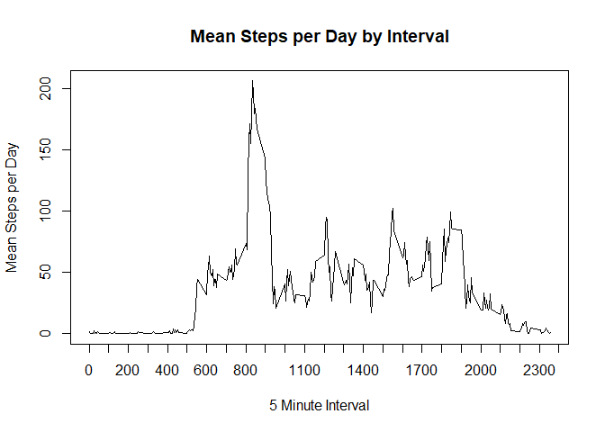
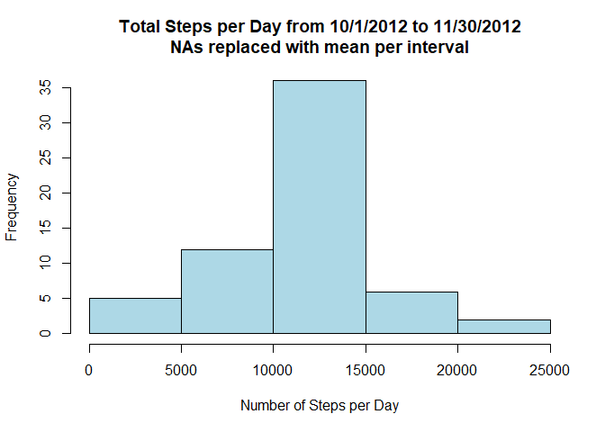
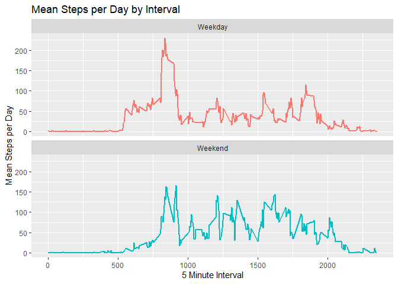

## Loading and preprocessing the data

Load the necessary libraries for this analysis.


```r
library(dplyr)
library(tidyr)
library(ggplot2)
```

The data is provided in the repository that was forked. Unzip the data if it has not already been unzipped, then read it into a dataframe.


```r
if(!file.exists("activity.csv")){unzip("./activity.zip")}

activities <- read.csv("activity.csv")
```

Preprocess the data by making a time field with interval converted to a time and a datetime field with the date and time.


```r
activities$time <- sprintf("%d:%02d",activities$interval %/% 100, activities$interval %% 100)
activities$datetime <- as.POSIXct(paste(activities$date,activities$time,sep=" "), "%Y-%m-%d %H:%M")
```

For now we will leave NA values. These will be replaced later in the analysis.

## What is mean total number of steps taken per day?

For this part of the analysis, missing values will be ignored.

1. Calculate the total number of steps taken per day.


```r
steps_day <- tapply(activities$steps,activities$date,sum,na.rm=TRUE)
head(steps_day)
```

```
## 2012-10-01 2012-10-02 2012-10-03 2012-10-04 2012-10-05 2012-10-06 
##          0        126      11352      12116      13294      15420
```

2. Plot the total number of steps per day as a histogram.


```r
hist(steps_day,main="Total Steps per Day from 10/1/2012 to 11/30/2012",xlab="Number of Steps per Day",col="light blue")
```

<!-- -->

3. Find the mean and median of the total number of steps taken per day.

The mean number of steps per day is 9354.23, and the median steps per day is 10395.


```r
mean(steps_day)
```

```
## [1] 9354.23
```

```r
median(steps_day)
```

```
## [1] 10395
```


## What is the average daily activity pattern?

1. Make a time series plot of the 5-minute interval and the average number of steps taken, averaged across all days.

First, find the mean number of steps per day for each 5-minute interval.


```r
steps_int <- aggregate(activities$steps,list(activities$interval),mean,na.rm=TRUE)
```

Next, plot the mean number of steps per day for each 5-minute interval.


```r
plot(steps_int$Group.1,steps_int$x,type="l",xaxp = c(0,2400,24),main="Mean Steps per Day by Interval",xlab="5 Minute Interval",ylab="Mean Steps per Day")
```

<!-- -->

2. Which 5 minute interval, on average across all days in the dataset, contains the maximum number of steps?

We find that the interval from 8:35-8:40am on average contains the maximum number of steps.


```r
steps_int[which.max(steps_int$x),1]
```

```
## [1] 835
```

## Imputing missing values

1. Calculate and report the total number of missing values in the dataset (ie. the total number of rows with NAs).

There are 2304 rows with a value of NA for the step count.


```r
nrow(subset(activities,is.na(activities$steps)))
```

```
## [1] 2304
```

2. Devise a strategy for filling in all the missing values in the dataset.

First, check that the date and interval columns do not contain any NA values.


```r
nrow(subset(activities,is.na(activities$date)))
```

```
## [1] 0
```

```r
nrow(subset(activities,is.na(activities$interval)))
```

```
## [1] 0
```

Only the steps column contains NA values. These will be replaced by the average number of steps in that interval over all days (ignoring NA values).

3. Create a new dataset that is equal to the original dataset but with the missing data filled in.

First, create a new dataframe that is a copy of the original to change the values in. Because we will be using mean values, we need to convert the steps column from an integer to a numeric value to handle decimal numbers. Then replace all NA values with the appropriate mean as described above.


```r
act_new <- activities

act_new$steps <- as.numeric(act_new$steps)

act_new %>%
  group_by(interval) %>%
  mutate_at(vars(steps), ~replace_na(.,mean(.,na.rm=TRUE))) -> act_new
```

4. Make a histogram of the total number of steps taken each data and calculate and report the mean and median total number of steps taken per day. 

First, calculate the total number of steps per day of the new dataframe with the NA values replaced.


```r
steps_day_new <- tapply(act_new$steps,act_new$date,sum,na.rm=TRUE)
```

Then plot the new data in a histogram.


```r
hist(steps_day_new,main="Total Steps per Day from 10/1/2012 to 11/30/2012\nNAs replaced with mean per interval",xlab="Number of Steps per Day",col="light blue")
```

<!-- -->

The new mean number of steps per day is 10,766.19, and the median is also 10,766.19. 


```r
mean(steps_day_new)
```

```
## [1] 10766.19
```

```r
median(steps_day_new)
```

```
## [1] 10766.19
```

Do these values differ from the estimates from the first part of the assignment? 

Yes, they do differ. Both the mean and the median values have increased.

What is the impact of imputing missing data on the estimates of total number of steps?

Imputing the missing data on the estimates of total number of steps has increased both the mean and median values for the total number of steps per day. There are now fewer days where the total number of steps are in the 0-5000 range and a greater number of days where the total number of steps are in the 10,000-15,000 range. The new values are not, however, substantially higher than when the NA values were ignored. 

## Are there differences in activity patterns between weekdays and weekends?

1. Create a new factor variable in the dataset with two levels - "weekday" and "weekend" indicating whether a given date is a weekday or weekend day.

Add a new column called daytype and start by setting that equal to the string value for the day of the week the date falls on. Then replace the values 'Saturday' and 'Sunday' with the value 'Weekend'. Next replace any values that are not already 'Weekend' with 'Weekday'.


```r
act_new$daytype <- weekdays(act_new$datetime)
act_new$daytype <- replace(act_new$daytype,act_new$daytype == 'Sunday' | act_new$daytype == 'Saturday',"Weekend")
act_new$daytype <- replace(act_new$daytype,act_new$daytype != 'Weekend',"Weekday")
```

2. Make a panel plot containing a time series plot of the 5-minute interval and the average number of steps taken, averaged across all weekday days or weekend days.

Note that this uses the data where the NA values have been replaced.


```r
act_new %>%
  group_by(interval,daytype) %>%
  summarize(mean=mean(steps)) %>%
  ggplot(aes(x=interval,y=mean,color=daytype)) + 
  geom_line(size=1,show.legend = FALSE) +
  facet_wrap(~daytype,ncol=1) +
  ggtitle("Mean Steps per Day by Interval") +
  xlab("5 Minute Interval") +
  ylab("Mean Steps per Day") 
```

<!-- -->
